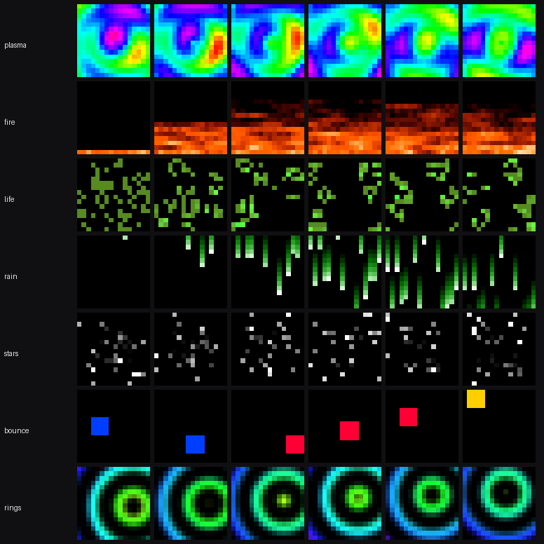
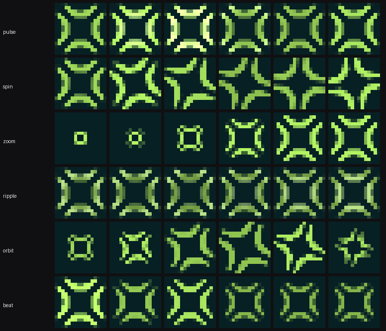
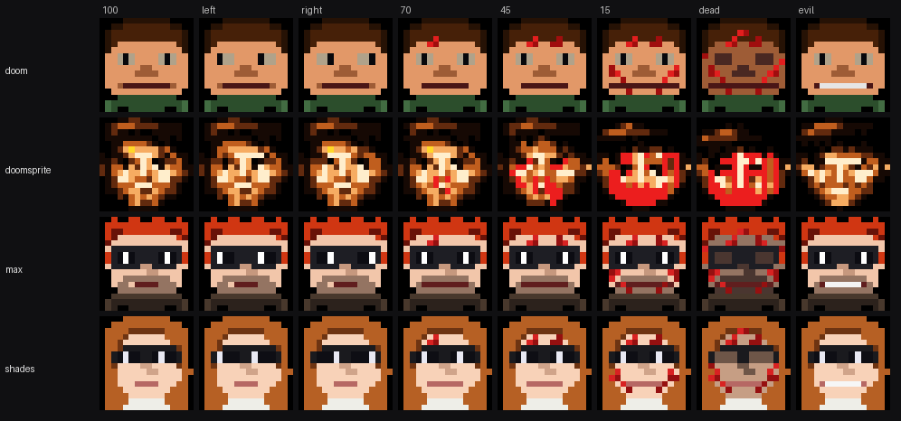
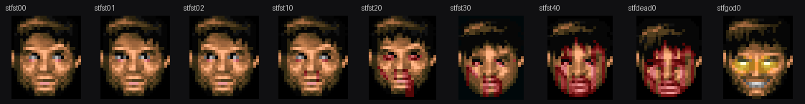

# divoom-timebox

Drive a Divoom Timebox Evo from a Mac. Effects, screensavers, Doom-style mugshots, and a webcam loop that checks the panel really shows what you sent.

## What is reused, what is not

The protocol is not mine. Framing, CRC and pixel packing all come from [RomRider's PROTOCOL.md](https://github.com/RomRider/node-divoom-timebox-evo/blob/master/PROTOCOL.md), cross-checked against [hass-divoom](https://github.com/d03n3rfr1tz3/hass-divoom) and [divo](https://github.com/spezifisch/divo). The test suite proves the lack of originality on purpose: it asserts that this encoder emits bytes **identical** to divo's and hass-divoom's across 19 palette sizes. A Divoom CLI is not a new idea either, and [divoom-minitoo-osx](https://github.com/alvinunreal/divoom-minitoo-osx) already showed that RFCOMM over IOBluetooth is the way in on macOS.

Three device behaviours documented below are, as far as I can tell, new. Each broke something here before being pinned down, and none were found by reading code. The Swift RFCOMM bridge for the Evo is new too: short, and it speaks a line protocol on stdio so you can drive it with `echo` when something misbehaves.

The part I would actually point someone at is the camera loop. Aim a webcam at the panel and the tool grades its own output. It locates the matrix, fits the grid, solves for the camera's colour response, then compares what came back against what went out.

## The three findings

### Animation chunks have to be paced

Write them back to back and the Mac's Bluetooth stack queues them faster than the Evo consumes them. It drops the tail and falls back to the clock face, having acknowledged every write. No reference implementation sleeps between chunks. Measured against the panel:

```
 0 ms between chunks    6% 7% 7%      fails every time past ~80 chunks
 5 ms                  78% 79% 79%    never fails
```

With 10 ms of pacing the size ceiling disappears: 43 KB across 206 chunks arrives intact, where it used to break around 18 KB.

### A 256-colour palette does not work

PROTOCOL.md says the opposite, *"You can't have more than 256 colors in a palette, but you only have 256 pixels on the screen so that's okay"*, but the Evo renders garbage for that one value. 255 is fine. The count byte is not a modulo-256 field.

### The first image after opening the channel is ignored

It is acknowledged and dropped; the panel keeps showing whatever was there before. Send a throwaway frame on connect.

## Install

```bash
git clone https://github.com/sderosiaux/divoom-timebox && cd divoom-timebox
./build.sh                       # compiles the Swift bridge, needs Xcode tools
uv venv && uv pip install -e .
```

Pair the Timebox in System Settings first. macOS grabs it as an audio device and that connection owns the RFCOMM channel, so the bridge drops the link before opening its own.

```bash
.venv/bin/python divoom.py --list        # paired devices
.venv/bin/python divoom.py --services    # advertised RFCOMM channels
.venv/bin/python divoom.py               # the shell
```

## Using it



```
fill red                      img photo.png            text "hello"
play plasma                   pan ~/Pictures/big.jpg   screensaver 45
logo spin                     face doom                bright 60
```

Effects stream as still images rather than uploading device animations, which sidesteps the Evo's ~60-frame animation cap. The link sustains 30fps at 1 KB per frame.

### The logo, six ways



`spin` rotates, `zoom` collapses to a point and reopens, `orbit` does both, `beat`
thumps twice and rests, `ripple` runs a wave through the mark, `pulse` breathes.

A mark with four-fold symmetry can rotate and still land on itself every 90
degrees, so only the first quarter-turn is animated. The coverage field is
averaged over its four quarter-turns before thresholding, which makes the
symmetry hold by construction at any angle rather than by luck. Coverage drives
brightness instead of an on/off mask, and that is what buys sub-pixel motion: a
hard threshold makes the shape jump a whole LED at a time, which on a 16-wide
panel reads as stepping rather than turning.

### Faces



`doomsprite` on the second row is the approach that did not work. Downscaling a
24x29 sprite looks reasonable and produces scattered orange with no silhouette,
because a face that size carries shading the panel cannot resolve. The row above
it is the same face redrawn at 16x16 from the sprite as reference, with every
tone that only existed to shade thrown away.

The source sprites come from Freedoom:



Faces are driven over a socket, so anything can move them:

```bash
printf 'hurt 25\n' | nc 127.0.0.1 8777      # also heal, health, evil, god, revive
```

## The camera loop

```
calibrate     locate the panel, solve the camera's colour matrix
autotest      nine patterns, verified automatically
effecttest    one frozen frame per effect
bisect        find where decoding breaks as the palette grows
```

Calibration makes the panel spell out red, then green, then blue, and keeps only the region that follows the sequence. Differencing against a black frame is the obvious approach and it fails in a room with a person in it: they move between shots and their silhouette dominates the diff. A moving silhouette cannot hold the commanded colour sequence in one place, so requiring the sequence filters it out.

The grid is interpolated inside the corner quad rather than split per axis. The panel is never perfectly square to the camera, and a bounding box gives the outer edges of the end LEDs rather than their centres. That alone cost a full row of drift at the far edge.

One lesson generalised beyond the protocol. Colours chosen on a monitor are wrong on LEDs, and not slightly. Doom's hair, the blonde's hair, the contrast ramp: each time, the tone picked by eye ranked near the bottom once measured on the panel.

```
hair tone       separation from skin, as the panel renders it
54,24,6                297
82,38,10               264
118,58,18              188      <- the one chosen by eye
140,40,20              143
```

## Tests

```bash
.venv/bin/python -m pytest tests/ -q
```

41 tests. The differential ones need the reference implementations, which are not vendored:

```bash
mkdir -p ref && cd ref
git clone --depth 1 https://github.com/spezifisch/divo
git clone --depth 1 https://github.com/d03n3rfr1tz3/hass-divoom
```

Without them those tests skip rather than fail.

## Credits and licences

Protocol documentation by [RomRider](https://github.com/RomRider/node-divoom-timebox-evo), with [hass-divoom](https://github.com/d03n3rfr1tz3/hass-divoom) and [divo](https://github.com/spezifisch/divo) as cross-references. The macOS RFCOMM approach follows [divoom-minitoo-osx](https://github.com/alvinunreal/divoom-minitoo-osx).

`assets/doom/` holds status-bar face sprites from [Freedoom](https://freedoom.github.io/), BSD 3-clause. Original art shaped like Doom's mugshot, none of id Software's pixels. See `assets/doom/SOURCE.md`.

The Conduktor mark in `assets/logo/` is a trademark of Conduktor, included with permission and not covered by this repository's licence.

Code is MIT. See `LICENSE`.
